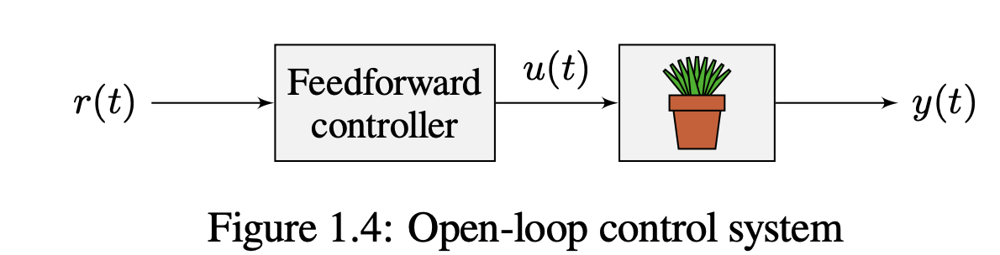

*controls-engineering-in-frc*
----
# 1. Control system basics
## 1-1. Gain
Gain is a proportional value.
## 1-2. Block diagrams

## 1-3. Open-loop and closed-loop systems
- r(t) reference 
- u(t) control input
- e(t) error 
- y(t) output

## 1-4. Feedforward
A controller that feeds information forward into the plant like this is called a feedforward controller.  
 
**modelbased feedforward** & **feedforward for unmodeled dynamics**
## 1-5. Why feedback control?

# 2. PID controllers

The **proportional** term drives the position error to zero, the **derivative** term drives the velocity error to zero, and the **integral** term accumulates the area between the setpoint and output plots over time (the integral of position error) and adds the current total to the control input.
## 2-1. Proportional term
$$u(t) = K_p\:e(t)=K_p\:(r(t)-y(t))$$

so the “force” with which the proportional controller pulls the system’s output toward the setpoint is proportional to the error, just like a spring.

## 2-2. Derivative term
$$u(t)=K_p\:e(t)+K_d\:\frac{de}{dt}$$
To prove a PD controller is just two proportional controllers, we will rearrange the equation for a PD controller
$$u_k=K_p\:e_k+K_d\:\frac{e_k-e_{k-1}}{dt}$$
then
$$u_k=K_p\:(r_k-y_k)+K_d\:\left(\frac{r_k-r_{k-1}}{dt}-\frac{y_k-y_{k-1}}{dt}\right)$$

## 2-3. Integral term

When the system is close to the setpoint in steady-state, the proportional term may be too small to pull the output all the way to the setpoint, and the derivative term is zero. This can result in **steady-state error**。
## 2-4. PID controller definition

## 2-5. Response types
A system driven by a PID controller generally has three types of responses: under-damped, overdamped, and critically damped
## 2-6. Manual tuning
These steps apply to position PID controllers. Velocity PID controllers typically don’t need Kd.
1. Set Kp, Ki, and Kd to zero.
2. Increase Kp until the output starts to oscillate around the setpoint.
3. Increase Kd as much as possible without introducing jittering in the system response. 

*Note*:  Adding an integral gain to the controller is an incorrect way to eliminate steady-state error. A better approach would be to tune it with an integrator added to the plant, but this requires a model. Since we are doing output-based rather than model-based control, our only option is to add an integrator to the controller.

## 2-7. Limitations
PID’s heuristic method of tuning is a reasonable choice when there is no a priori knowl- edge of the system dynamics. However, controllers with much better response can be developed if a dynamical model of the system is known. Furthermore, PID only applies to single-input, single-output (SISO) systems; we’ll cover methods for multiple-input, multiple-output (MIMO) control in part II of this book.

# 3. Application advice
## 3-1. Mechanical vs software solutions
The solution to a design problem may be a tradeoff between mechanical and software complexity.  
## 3-2. Actuator saturation

# 4. Calculus

# 5.Linear algebra
## 5.11 Common control theory matrix equations
difficult(cry~)
## 5.12 Matrix calculus

# 6. Continuous state-space control
## 6.2 dynamical system
linear
## 6.3 Continuous state-space notation

